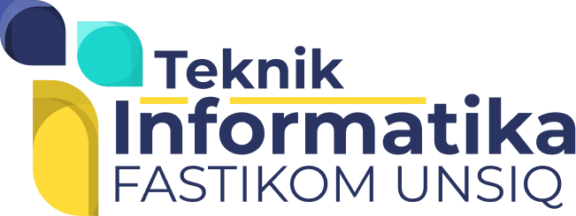
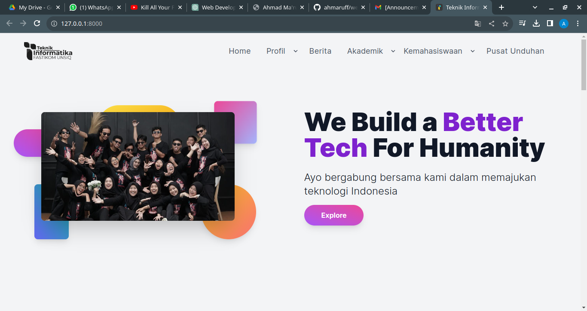
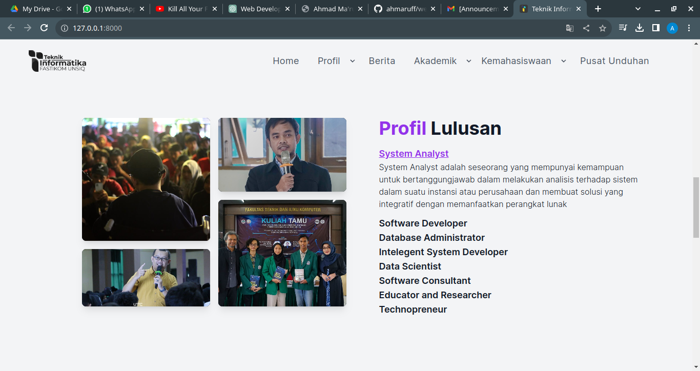
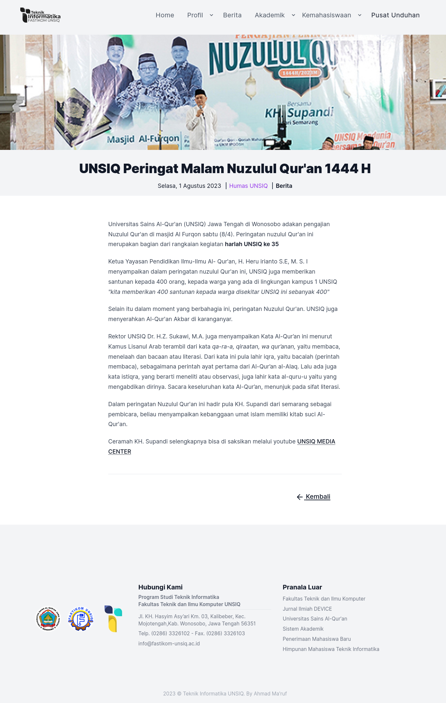
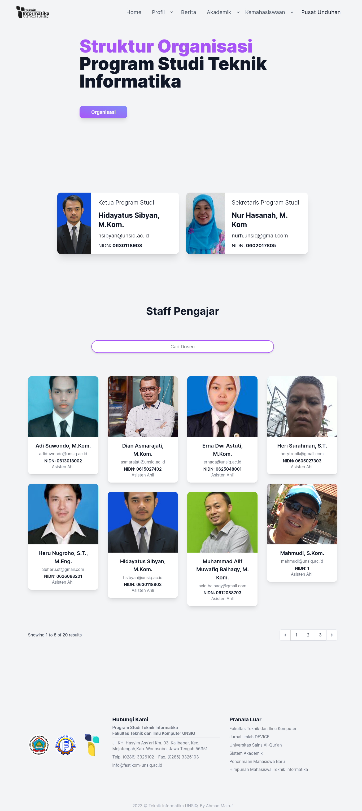
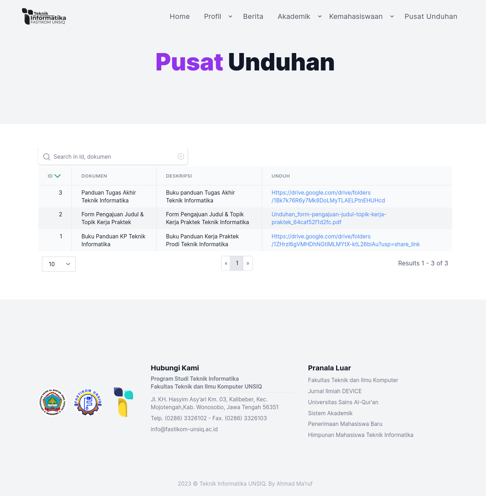
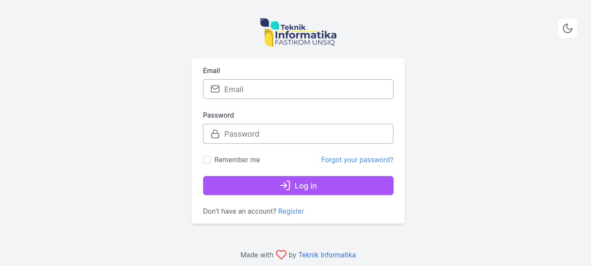
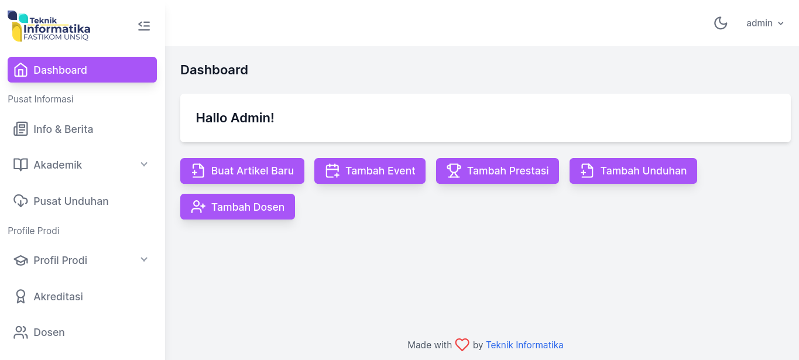
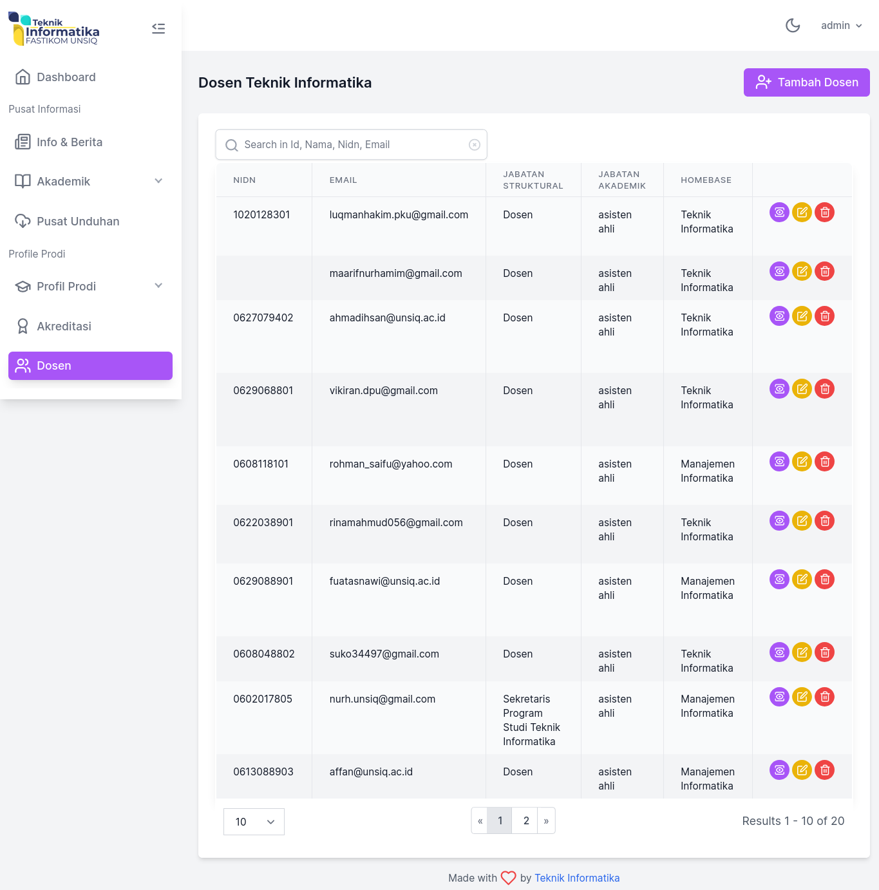
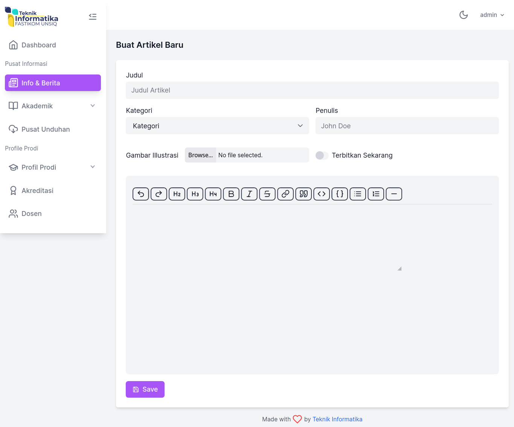

## Web Prodi Teknik Informatika
Project ini merupakan project yang dibuat untuk lomba Web Programming Euphoria 2023 by HIMTI UNSIQ.  
Project ini merupakan project Sistem Informasi & Landing Page untuk Prodi Teknik Informatika UNSIQ. Project ini dibuat menggunakan Laravel 10 dengan frontend menggunakan Tailwind CSS & AlpineJS

## Screenshot

## Instalation

- Clone
- install dependencies `composer install`
- set .env file (database,appkey,etc)
- run migration `php artisan migrate`
- run seeder
  - `php artisan db:seed UserSeeder`  
  - `php artisan db:seed HimtiProkerSeeder`
  - `php artisan db:seed InfoAkademikSeeder`
  - `php artisan db:seed ProfilDosenSeeder`
  - `php artisan db:seed ProfilLulusanSeeder`
  - `php artisan db:seed ProfilProdiSeeder`
- run server `php artisan serve`
